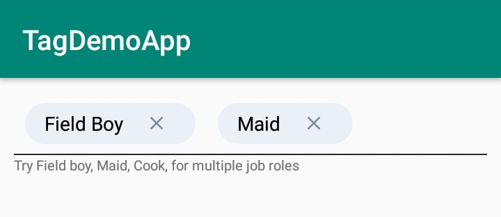

# Android TagsEditText View for text view with tags

## How to use ##


Add it in your root build.gradle at the end of repositories:
```groovy
allprojects {
	repositories {
		maven { url "https://jitpack.io" }
	}
}
```
Step 2. Add the dependency
```groovy
dependencies {
	implementation 'com.github.anonymous-ME:TagsEditText:0.1.0'
}
```
Step 3. Add TagsEditText to your layout file
```xml
<affan.ahmad.tagsedittext.TagTextView
        android:layout_width="match_parent"
        android:layout_height="wrap_content"/>
```
## Screen Shot ##

